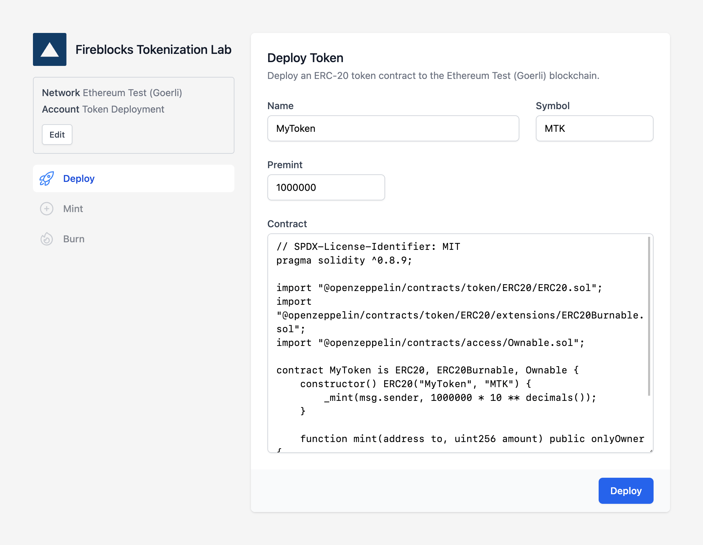

<h1 align="center">

<br />
Fireblocks Tokenization Lab
</h1>

<p align="center">
Deploy, mint, and burn an ERC-20 token
</p>

<a href="https://gitpod.io/#https://github.com/fireblocks/tokenization-lab" target="_blank">
<p align="center">

</p>
</a>

---

<a href="https://gitpod.io/#https://github.com/fireblocks/tokenization-lab" target="_blank">
<p align="center">

</p>
</a>

## 🔐 Authentication

This lab uses the Fireblocks API and requires an API key and API private key. You'll set your API key in the browser, and there's two ways you can set your API private key:

1. Place your API private key within the repository root at `api.key`. This file will be ignored by Git. _or_
2. Set the `PRIVATE_KEY_B64` environment variable to a base64 encoding of your API private key. You can get a base64 encoding of your private key file with:

   ```bash
   # Reads api.key and outputs base64
   base64 -i api.key
   ```

## 🔨 Development

To create an instant development environment, [open the app in Gitpod](https://gitpod.io/#https://github.com/fireblocks/tokenization-lab). To run it on your local system, clone the repository, and install the LTS version of [Node.js](https://nodejs.org/en/download/).

### Set up Node.js

```bash
# Install nvm if you haven't already
curl -o- https://raw.githubusercontent.com/nvm-sh/nvm/v0.39.3/install.sh | bash

# Install Node.js from .nvmrc
nvm use

# Install dependencies
npm install
```

### Start project

```bash
npm run dev
```

## ⚖️ Legal

[Copyright © 2023 Fireblocks](https://www.fireblocks.com)

[MIT License](LICENSE)
